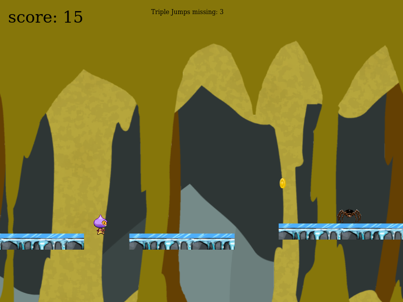

# Project Save the pets - Javascript Game

This is a game in which you need to survive without falling off the platforms and skipping enemies. You have both a history mode (with 3 different phases that increases the difficulty) and a free mode (in which you can choose whatever phase you want.

### How to Play it

You need to jump from one platform to another. To jump, either press space, or click with the left button in your mouse. Your score increases with time, and every coin is worth 20 points.

### Screenshots

#### Main Menu

- 

#### Phase One

- 

##### Phase Two

- 

##### Phase Three

- 

### FEATURES

Two differents modes for playing. Function for saving and displaying the high scores.

### BUILT WITH

- HTML Canvas
- Javascript
- Webpacker
- Phaser 3

### LIVE VERSION

- [GitHack](https://raw.githack.com/expjazz/weather_app/featureV1/dist/index.html)

### Getting Started

- Clone the project to your local machine;
- `cd` into the project directory;
- Run `npm install` to install the necessary modules;
- To check in development mode, run `npm start`, the page will automatically load on [localhost:3000](localhost:3000).

### AUTHORS

👤Expedito Andrade

- Github: [@githubexpjazz](https://github.com/expjazz)
- Twitter: [@expjazz](https://twitter.com/expeditoandrade13)
- Linkedin: [Expedito Andrade](https://www.linkedin.com/in/expedito-andrade/)
- Portfolio: [Expedito Andrade](https://expjazz.github.io/expedito_andrade/)

### Show your support

Give a star if you like this project!

### Acknowledgments

- Microverse

### 🤝 Contributing

Contributions, issues and feature requests are welcome! Start by:

- Forking the project
- Cloning the project to your local machine
- `cd` into the project directory
- Run `git checkout -b your-branch-name`
- Make your contributions
- Push your branch up to your forked repository
- Open a Pull Request with a detailed description to the development branch of the original project for a review

### Show your support

Give a ⭐️ if you like this project!

### 📝 License

This project is MIT licensed
